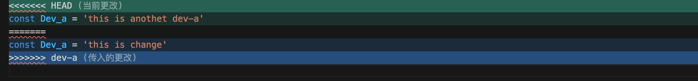
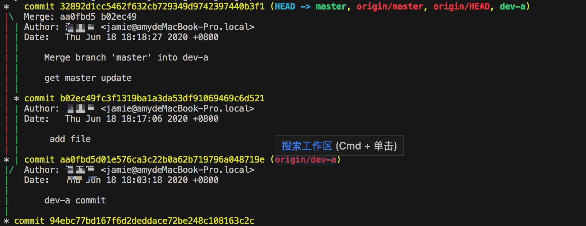
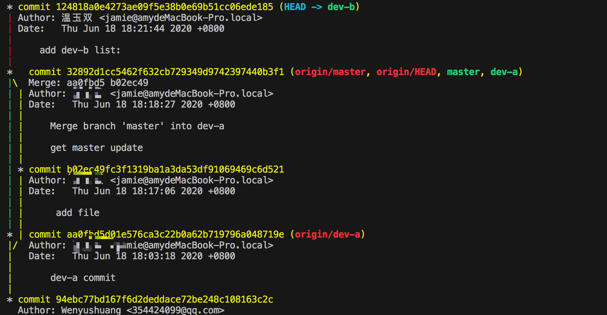

# git-rebase

## git merge和 git rebase 都是基于合并代码的操作

- git merge 将俩个分支 合并提交为一个新的commit
- git rebase 会取消分支中的每个commit 临时存放起 然后当当前分支更新到最新的origin分支 然后再把所有提交应用到分支上

### 设计场景 分支dev-a 分支dev-b 分支A修改代码后合并定到master分支 分支B合并时就会发生冲突

